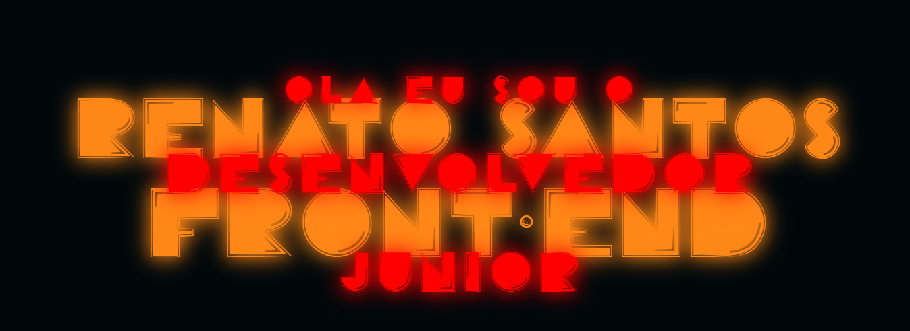

# Portifolio

<h1>

</h1>

<h4 align=center> 
    🚧 Projeto em constante atualização 🚧
</h4>

# Topicos
* [Descrição do projeto](#descrição-do-projeto)
* [Aplicação](#aplicação)
* [Ferramentas utilizadas](#ferramentas-utilizadas )
* [Desenvolvedor](#desenvolvedor)

# Descrição-do-Projeto

Esse projeto foi desenvolvido para ser o meu portifólio, que vai ser onde vou colocar todos os meus projetos que criarei durante os meus estudos.

deixarei à mostra projetos pequenos e independentes, e projetos maiores teram sua propria pagina de descrição e logo sua propria pagina individual.

# Aplicação

<video heigth=200px alt=readme title=readme src="./logos/port-desc-mobile-at.mp4" autoplay loop>

<video width=95% alt=readme title=readme src="./logos/port-desc-at.mp4" autoplay loop>

<video width=95% alt=readme title=readme src="./logos/port-jogos-at.mp4" autoplay loop>

<video width=95% alt=readme title=readme src="./logos/port-gameMemoria.mp4" autoplay loop>

<video width=95% alt=readme title=readme src="./logos/port-site-exemplo.mp4" autoplay loop>

# Ferramentas-Utilizadas 

# Desenvolvedor 

| [ Renato dos Santos](https://github.com/RenatoDevs) 
| :---: |
